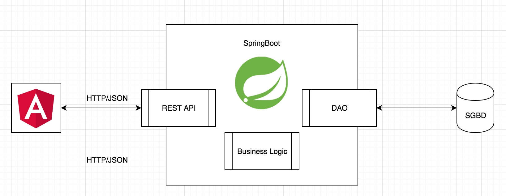

# nearby-shops (Backend)

##### Made with Java.
the FrontEnd Service made with Angular 6  [Frontend](https://github.com/n0thinghs/NearbyShop-front).

##### Implemented functionalities:

- [x] As a User, I can sign up using my email & password
- [x] As a User, I can sign in using my email & password
- [x] As a User, I can display the list of shops sorted by distance
- [x] As a User, I can like a shop, so it can be added to my preferred shops
        Acceptance criteria: liked shops shouldn’t be displayed on the main page
- [ ] As a User, I can dislike a shop, so it won’t be displayed within “Nearby Shops” list during the next 2 hours
- [x] As a User, I can display the list of preferred shops
- [x] As a User, I can remove a shop from my preferred shops list

##### Technical architecture:

